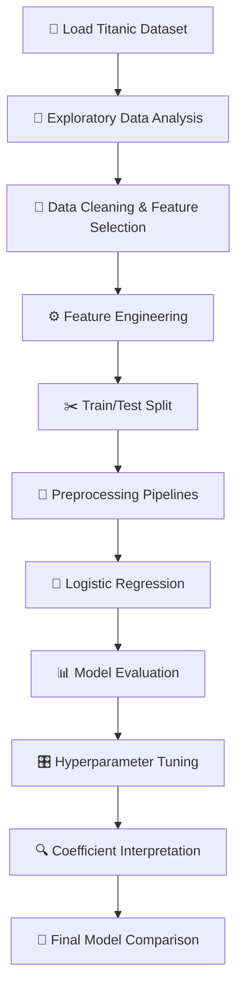

# 🚢 Titanic Survival Prediction

<p align="center">
  <strong>A Machine Learning Classification Project with Logistic Regression</strong>
  <br>
  Exploring passenger data, building preprocessing pipelines, and predicting survival outcomes.
</p>

<p align="center">
  
  
  
  
</p>

---

## 📌 Project Overview

The goal of this project is to predict whether a passenger survived the Titanic disaster using **Logistic Regression** and Seaborn's Titanic dataset.

Beyond building a classifier, this project explores the complete Machine Learning workflow — from exploratory data analysis and preprocessing to model evaluation, hyperparameter tuning, and coefficient interpretation.

| Component | Description |
|---|---|
| **Problem Type** | Binary Classification |
| **Dataset** | Seaborn Titanic Dataset |
| **Target Variable** | `survived` |
| **Algorithm** | Logistic Regression |
| **Implementation** | Python & Scikit-learn |
| **Notebook** | `titanic_logistic_regression_complete.ipynb` |

### 🎯 Prediction Target

- `0` — Passenger did not survive
- `1` — Passenger survived

## 🗺️ Project Workflow



## 🔎 01 — Exploratory Data Analysis

Investigated the dataset to understand its structure, quality, and relationships before training the model.

- Inspected dataset dimensions, columns, and data types.
- Analyzed missing values and their percentages.
- Generated descriptive statistics.
- Examined survivor and non-survivor distributions.
- Compared survival rates by sex and passenger class.
- Inspected exact duplicate rows without automatically deleting them.

## 🧹 02 — Feature Selection & Data Preparation

Selected features that provide useful passenger information while avoiding redundant or target-revealing columns.

**Initial features:**

`pclass` · `sex` · `age` · `sibsp` · `parch` · `fare` · `embarked`

**Target leakage prevention:**

The `alive` column was excluded because it directly reveals the target. Redundant alternatives such as `class` and `embark_town` were also omitted. The high-missingness `deck` column and identifier/free-text fields were excluded from this initial experiment.

## ⚙️ 03 — Feature Engineering

Created additional features from existing passenger information:

| Feature | Definition |
|---|---|
| `family_size` | `sibsp + parch + 1` |
| `is_alone` | `1` if `family_size == 1`, otherwise `0` |

These features represent family size and whether a passenger was traveling alone.

## 🔄 04 — Preprocessing Pipeline

Separated numerical and categorical features and applied appropriate transformations through Scikit-learn pipelines.

<table>
  <tr>
    <th>Numerical Features</th>
    <th>Categorical Features</th>
  </tr>
  <tr>
    <td>
      <code>age</code><br>
      <code>sibsp</code><br>
      <code>parch</code><br>
      <code>fare</code><br>
      <code>family_size</code><br>
      <code>is_alone</code>
    </td>
    <td>
      <code>pclass</code><br>
      <code>sex</code><br>
      <code>embarked</code>
    </td>
  </tr>
</table>

### Numerical Pipeline

1. `SimpleImputer(strategy="median")`
2. `StandardScaler()`

### Categorical Pipeline

1. `SimpleImputer(strategy="most_frequent")`
2. `OneHotEncoder(handle_unknown="ignore")`

Both pipelines are combined using `ColumnTransformer`, then connected to Logistic Regression through a `Pipeline`.

> **Key practice:** Split the dataset before fitting preprocessing transformations. This prevents information from the test set from leaking into the training process.

## ✂️ 05 — Train/Test Split

The dataset is split into:

- **80% training set** — Used to fit the model and preprocessing transformations.
- **20% test set** — Reserved for evaluating model performance on held-out data.

The split uses `random_state=42` for reproducibility and `stratify=y` to preserve approximately the same target-class proportions in both sets.

## 🧠 06 — Model Training

Trained a Logistic Regression classifier with `max_iter=2000`.

The model generates:

- Class predictions using `predict()`
- Survival probabilities using `predict_proba()`

The notebook also reports the number of solver iterations used during fitting.

## 📊 07 — Model Evaluation

Evaluated the classifier on the held-out test set using:

| Metric | Purpose |
|---|---|
| Accuracy | Overall proportion of correct predictions |
| Precision | Proportion of positive predictions that are correct |
| Recall | Proportion of actual survivors identified |
| F1 Score | Harmonic mean of precision and recall |
| Confusion Matrix | Breakdown of correct and incorrect classifications |
| Classification Report | Summary of class-level evaluation metrics |

Training accuracy is compared with test accuracy as an initial diagnostic for possible overfitting or underfitting.

### 🎚️ Classification Threshold

The notebook explores how changing the classification threshold from `0.5` to `0.4` affects predictions and evaluation metrics.

Threshold selection should be based on validation data rather than repeatedly optimizing against the held-out test set.

## 🧪 08 — Preprocessing Strategy Comparison

Compared two alternative preprocessing configurations:

- **Configuration A:** Median imputation for numerical features and most-frequent imputation for categorical features.
- **Configuration B:** Mean imputation for numerical features and a dedicated missing category for categorical features.

Both configurations are fitted using training data and compared using test metrics.

## 🎛️ 09 — Hyperparameter Tuning

Used `GridSearchCV` with five-fold stratified cross-validation to explore different values of the Logistic Regression parameter `C`.

| Parameter | Values |
|---|---|
| `C` | `0.01`, `0.1`, `1.0`, `10.0`, `100.0` |
| Cross-validation | 5-fold Stratified K-Fold |
| Scoring | F1 Score |

**Understanding `C`:**

- Smaller `C` → stronger regularization.
- Larger `C` → weaker regularization.

The best configuration is selected through cross-validation on the training data, then evaluated on the held-out test set.

## 🔍 10 — Model Interpretability

Extracted feature names and coefficients from the fitted Logistic Regression model.

- **Positive coefficient:** Increases the modeled log-odds of survival, holding other encoded features constant.
- **Negative coefficient:** Decreases the modeled log-odds of survival.
- **One-hot encoded features:** Coefficients are interpreted relative to the omitted reference category.

Coefficients describe associations learned by the model; they do not establish causation.

## 🏁 11 — Final Model Comparison

Compared the baseline and tuned models using the same held-out test set.

The notebook concludes with a checklist for documenting:

- Which model performed best and why.
- Which features appear influential according to the coefficients.
- Whether false positives or false negatives are more common.
- Whether there is evidence of overfitting or underfitting.
- What limitations remain and which experiment could be explored next.

**Actual metrics and conclusions must be filled in after executing the notebook.** No performance scores are assumed or hard-coded in this documentation.

## 🛠️ Tech Stack

| Technology | Usage |
|---|---|
| Python | Core programming language |
| NumPy | Numerical operations |
| Pandas | Data manipulation |
| Seaborn | Dataset loading and visualization |
| Matplotlib | Charts and plots |
| Scikit-learn | Preprocessing, modeling, and evaluation |
| Jupyter Notebook | Interactive experimentation |

## 🚀 How to Run

1. Open `titanic_logistic_regression_complete.ipynb` in Jupyter Notebook or VS Code.
2. Select a Python environment with the required dependencies installed.
3. Run the notebook cells from top to bottom.
4. Install any missing dependencies in the same environment.
5. Ensure internet access is available if the Seaborn dataset needs to be downloaded.

Install the main dependencies with:

```bash
pip install numpy pandas seaborn matplotlib scikit-learn jupyter
```

## 💡 Key Takeaways

- Explore the dataset before choosing preprocessing strategies.
- Avoid target leakage and redundant features.
- Investigate duplicates instead of deleting them blindly.
- Fit imputers, encoders, and scalers on training data only.
- Use pipelines to maintain consistent preprocessing.
- Use cross-validation for model selection.
- Reserve the test set for final evaluation.
- Interpret metrics and model coefficients in context.

## 📂 Project Structure

```text
Logistic Regression/
├── Logistic Regression.ipynb
└── Project/
    ├── README.md
    └── titanic_logistic_regression_complete.ipynb
```

## 🌱 Project Status

The notebook contains the implementation of the complete experiment, including preprocessing, model training, evaluation, and tuning.

The next step is to execute the notebook, review the actual results, and document the final findings.

---

<p align="center">
  <strong>Learn the concepts. Build the pipeline. Evaluate the model. Improve the results.</strong>
  <br><br>
  Made with 🧠, Python, and curiosity.
</p>
