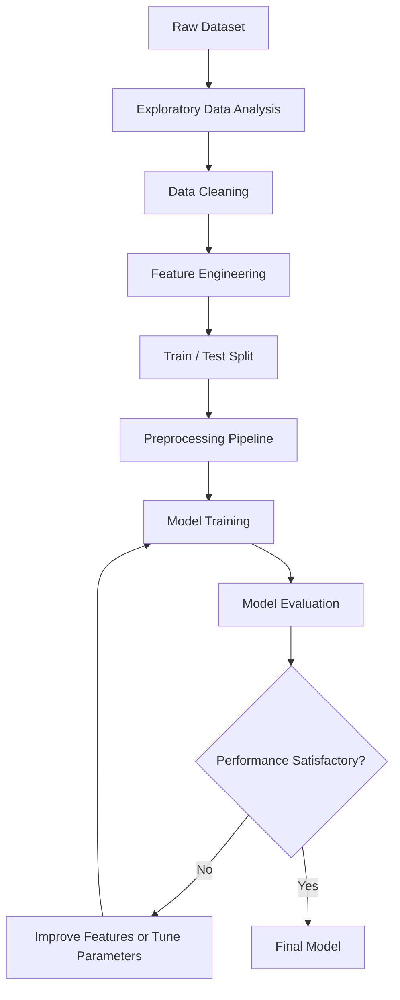

# 🧠 Machine Learning

  <strong>From Raw Data to Intelligent Models.</strong>
   
  A hands-on journey through Machine Learning concepts, preprocessing techniques, algorithms, and practical projects.

  
  
  
  

---

## 🎯 About This Repository

Welcome to my **Machine Learning** repository!

This is where I build my understanding of Machine Learning through practical coding, experiments, and real-world datasets. The focus is on understanding not only how algorithms work, but also how to prepare data, build reliable models, evaluate results, and improve performance.

From cleaning messy datasets to training predictive models, every notebook represents a step toward mastering the Machine Learning workflow.

## 🗺️ Learning Roadmap

<table>
  <tr>
    <td width="50%">
      <h3>🧹 Data Preprocessing</h3>
      <ul>
        <li>Handling missing values</li>
        <li>Encoding categorical variables</li>
        <li>Feature scaling and standardization</li>
        <li>Outlier and duplicate analysis</li>
        <li>Data leakage prevention</li>
      </ul>
    </td>
    <td width="50%">
      <h3>🔎 Exploratory Data Analysis</h3>
      <ul>
        <li>Statistical summaries</li>
        <li>Data distributions</li>
        <li>Correlation analysis</li>
        <li>Data visualization</li>
        <li>Pattern and relationship discovery</li>
      </ul>
    </td>
  </tr>
  <tr>
    <td width="50%">
      <h3>⚙️ Feature Engineering</h3>
      <ul>
        <li>Feature creation and transformation</li>
        <li>Feature selection</li>
        <li>Numerical and categorical features</li>
        <li>Preparing features for modeling</li>
      </ul>
    </td>
    <td width="50%">
      <h3>🧠 Machine Learning Algorithms</h3>
      <ul>
        <li>Linear and Logistic Regression</li>
        <li>K-Nearest Neighbors</li>
        <li>Decision Trees and Random Forest</li>
        <li>Support Vector Machines</li>
        <li>K-Means Clustering</li>
      </ul>
    </td>
  </tr>
  <tr>
    <td width="50%">
      <h3>📊 Model Evaluation</h3>
      <ul>
        <li>Accuracy, Precision, and Recall</li>
        <li>F1 Score and ROC-AUC</li>
        <li>MAE, MSE, and RMSE</li>
        <li>Confusion matrices</li>
      </ul>
    </td>
    <td width="50%">
      <h3>🚀 Model Optimization</h3>
      <ul>
        <li>Train/test split and cross-validation</li>
        <li>Overfitting and underfitting</li>
        <li>Bias-variance trade-off</li>
        <li>Hyperparameter tuning</li>
        <li>Model comparison and improvement</li>
      </ul>
    </td>
  </tr>
</table>

## 🧪 Hands-On Projects

### 📈 Linear Regression

Exploring regression fundamentals, fitting models to data, generating predictions, and measuring prediction errors.

### 🚢 Titanic Survival Prediction

A classification project using the Titanic dataset to practice:

- Exploratory Data Analysis
- Missing-value imputation
- Categorical encoding and feature scaling
- Feature engineering
- Train/test splitting
- Logistic Regression
- Classification metrics and model evaluation

> Each project is an opportunity to turn theoretical concepts into practical Machine Learning skills.

## 🛠️ Tech Stack

| Tool | Purpose |
|---|---|
| **Python** | Core programming language |
| **NumPy** | Numerical computing |
| **Pandas** | Data manipulation and analysis |
| **Matplotlib & Seaborn** | Data visualization |
| **Scikit-learn** | Preprocessing, modeling, and evaluation |
| **Jupyter Notebook** | Interactive experiments |
| **Git & GitHub** | Version control and project organization |

## 🔄 The Machine Learning Workflow

## 💡 Core Principles

- **Understand the data before modeling.**
- **Fit preprocessing steps on training data only.**
- **Prevent data leakage.**
- **Choose evaluation metrics that match the problem.**
- **Compare models instead of relying on a single result.**
- **Focus on understanding why a model works, not just running the code.**

## 📂 Repository Organization

The repository is organized into topic-based folders, with Jupyter notebooks and project documentation that make it easier to revisit concepts and track progress.

## 🌱 What's Next?

This repository will evolve as I explore more Machine Learning techniques, experiment with different datasets, and build increasingly challenging projects.

The goal is simple: **learn the fundamentals deeply, practice consistently, and build models that solve meaningful problems.**

---

  <strong>Built with curiosity, Python, and a passion for Machine Learning. 🧠</strong>
    
  <a href="https://github.com/ZeyadHany6x11">GitHub Profile · Zeyad Hany</a>

